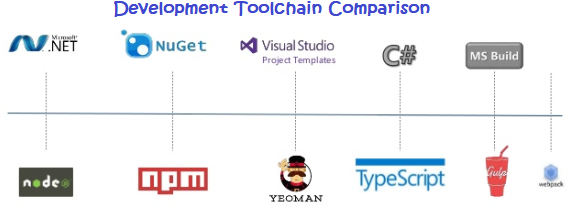

In the last session, we have covered comparision of the development and deployment story for customizations created using the SharePoint Framework to those using a more traditional SharePoint approach.

Here, I will provide an overview of the SharePoint Framework development toolchain.

The first thing you will need is a SharePoint developer tenant. This is a tenant in SharePoint online in office 365. This environment also has a copy of the SharePoint workbench that you can use to test our web parts out as well. The workbench is a locally hosted page that can host your SharePoint client-side web parts. Using this page you can develop and test locally, all without a full SharePoint deployment.

Now let’s look at the different tools you will need, but in doing so, let’s compare them to what you are used to using if you are coming from the traditional SharePoint or .NET development world.

Node.js

The traditional Microsoft way of doing development is building on the .NET Framework. This is the runtime that knows how to run the programs.
Node.js addresses this need. A lot of the tools in the modern web development world are built on top of Node.js.

NPM

When building .NET applications, we use a tool called NuGet to acquire prebuilt packages for use within our application.
In the Node world, we use a tool called NPM that does the same thing. We will use this to get packages our customizations need like Angular, jQuery or other useful libraries.

Yeoman

Visual Studio is Microsoft’s integrated development environment. When we want to create a new project, we use Visual Studio’s project templates to create the file & folder scaffolding for the project.
With the SharePoint Framework, you can use any editor you want. But to get the folder & file scaffolding created for the project we use a tool called Yeoman. You can install different project generators for Yeoman. Microsoft provides one for SharePoint client-side web parts that we will use as the starting point for our new project.

TypeScript

TypeScript is a strongly typed, object oriented, compiled language. It was designed by Anders Hejlsberg (designer of C#) at Microsoft. TypeScript is both a language and a set of tools. TypeScript is a typed superset of JavaScript compiled to JavaScript. In other words, TypeScript is JavaScript plus some additional features.
SharePoint client-side development tools are built using TypeScript classes, modules, and interfaces. You can use these to build robust client-side web parts.

To get started with TypeScript, see the following resources:

[TypeScript Quick Start](https://www.typescriptlang.org/docs/tutorial.html)

[TypeScript Playground](https://www.typescriptlang.org/play/index.html)

[TypeScript Handbook](https://www.typescriptlang.org/docs/handbook/basic-types.html)

Gulp

Now, you know when you build a project in Visual Studio, some process kicks off to compile the project, maybe it manually starts up another process with your app in it and attaches a debugger? That’s not Visual Studio doing that, that’s Visual Studio calling MSBuild. Someone created tasks for MSBuild using an XML syntax what to do such as compile the project, copy the files from here to there and fire up a process followed by attaching the debugger.
The tool Gulp does the same thing. It allows you to write tasks using JavaScript and then tell Gulp to run those tasks for you.

Webpack

This comparison is not exact, but you’ll get the point. With a traditional SharePoint project, you compile the project files into an executable or a DLL.
In the JavaScript world, we have a similar process where we want to merge multiple files into a single bigger file for performance & manageability. The tool Microsoft selected for the SharePoint Framework is Webpack.

I think, we have covered a lot, it’s actually pretty simple, everything is free and does not require some big install. With a typical broadband connection or connecting mobile data, you can be up and running in 10 minutes or less.

In next section, we will focus on what we need.
