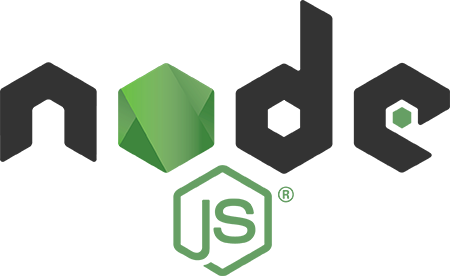
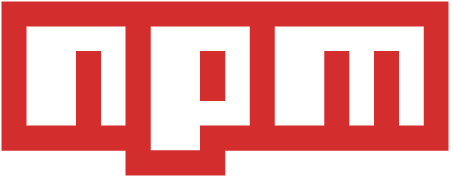
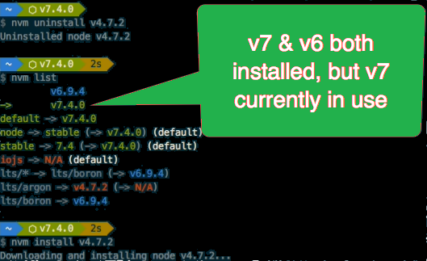

So far we have covered about toolchain. Also, we understood it's important in SPFx development.

Here, we will explore further on Node.js and NPM. They are usually grouped together, and while I am doing that here in this installment, I personally see them as two very different things.

Though, in the context of SharePoint Framework development, you don’t need to focus much at all on Node.js; just install it and move on. NPM is where you need to make sure that you are familiar with the commands including how to query, manage and upgrade new versions, etc.

However, Node.js needs to focus more. If you are working on MacOS, you should consider using a node version manager, or the node version manager: NVM, though it is not required.

What is Node.js? 

Node.js, commonly just referred to as Node, is a cross-platform runtime that enables developers to create applications written in JavaScript that run on devices such as servers, desktops, laptops, embedded devices… lots of stuff.

It does this by hosting the Chromium project’s V8 JavaScript virtual machine. Chromium is the open-source browser project that Google’s Chrome browser is based on. It also includes APIs for interacting with the local device for things like file IO, environment variables, and networking.

There are two main distributions of Node.js. The long-term support or LTS version is a version that has strict requirements for new features and updates. This is the version that many enterprises use because it’s not always changing and improving. It is also the version that Microsoft recommends for development with the SharePoint framework.

The other is what they call the current version. This has the latest features added to Node.js. Eventually, these features will make it into the LTS version, but in current they are less mature.

Why do you need Node.js? 

Most of the toolchain for development of SPFx built on Node.JS, so it require. This gives us the cross-platform aspect of SharePoint framework development.

So, what is NPM? NPM is the package manager for Node.js. NPM is a node.js based tool that you use to acquire and manage packages within your projects. Some Node.js tools are also distributed using NPM. For instance, when you want to install a new version of the TypeScript compiler, you will run...

`NPM install -g typescript`

This tells NPM to install the package TypeScript globally. When you install something globally, it’s available anywhere in your environment. If you leave off that -g it is installed locally in the current working directory.

A special note makes sure you are using NPM version 5 or higher. The reason for this is prior to version 5 (actually prior to version 3) create some issue in Windows OS. NPM version 3 flatted this and kept everything in a single folder.

Installing Node.js & NPM

There are two ways you can get Node.js installed on your environment:

**Option 1:** Follow instructions on [https://nodejs.org/en/download/](https://nodejs.org/en/download/) for LTS.
The first option is to head to the Node.js website, download an installer for the latest LTS version for your platform and follow the instructions.

**Limitation**

* This works, but you will find at times you have to work with Node.js as an admin, either within an administrative command prompt in Windows or by prefixing any Node based commands with sudo on MacOS or Linux.

* The other limitation of this approach is you can only have one version of Node.js & NPM installed at any time on your developer environment. Generally, that is not a big deal, it is just annoying at times.

**Option 2:** Install using Node.js Version Manager (NVM)

The other option that I prefer is to use the Node.js version manager or NVM. Once installed, this helps you acquire different versions of node and switch between them.

Each Node.js install you get has its own global package installation folder so you can have different globally installed versions between node runtime installs.

It also avoids admin command prompts because it installs the node runtime within your profile. Since you always have admin rights over your profile, you are effectively always running as admin.

Personally, I like managing my Node.js installs using NVM because it lets me use the latest features but also get the flexibility of jumping between versions and trying new things out without impacting my current stable setup.

* NVM for MacOS: https://github.com/creationix/nvm 
* NVM for Windows: https://github.com/coreybutler/nvm-windows 

There is a version of NVM for both MacOS and Windows depending on your platform of choice.

Installing NVM and Node.js is very straightforward using the links I just provided. Personally, I’m a huge fan of NVM and use the versions listed above in both my MacOS laptop and Windows laptop.

Additional Package Manager Options: Yarn & PNPM

NPM was the first package manager used to pull packages down from the NPM package registry at [https://www.npmjs.org](https://www.npmjs.org). This registry is the primary registry all Node.js projects and most client-side packages are pulled from. It’s replaced other registries such as Bower.

NPM maintained a hold on the package management space for a while, leaving developers to address its shortcomings around speed, consistency and version locking. Since competing package managers were introduced, specifically Yarn, NPM has stepped up its game and is on par for the most part with the others out there.

[Yarn - https://yarnpkg.com](https://yarnpkg.com)

Yarn was created as a collaboration between Facebook and Google to address the shortcomings of NPM. The two biggest things it added was the concept of a lockfile and package cache.

The package cache helped eliminate the issue where each time you installed packages in a new project, instead of pulling a new copy from the NPM registry, Yarn would first check to see if you had already downloaded it in the past. If you had, it would skip the download process and instead just copy the package from the local cache into your project folder.

The lockfile would ensure that each time packages were installed with yarn, it the same version you got last time would be downloaded. Before this concept was introduced, if you ran installed packages on a Monday with NPM, and someone installed them on the same project on Wednesday, there was no guarantee you would get the same versions of the packages because someone may have shipped an update between the two days.

[PNPM - https://pnpm.js.org](https://pnpm.js.org)

This is the newest one on the scene. It does everything the other two generators do in the sense of lockfiles and a package cache. However, it has one different characteristic…

Instead of copying the packages from the cache to the project, it creates a hard link from the project’s node_modules folder to the folder in the package cache. This means your project folders are much smaller!

Which Package Manager Should You Use? 

I would encourage you to consider the options and decide which one makes the most sense for you. 

In next section, we will further look over on Yeoman.  
